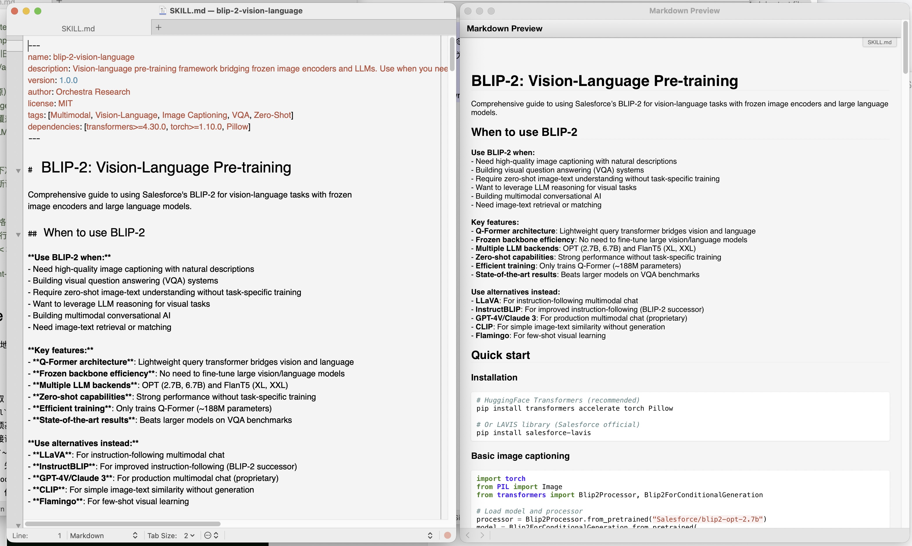

# textmate-markdown-ext-2026

A practical enhancement toolkit for TextMate Markdown preview, focused on a Typora-like reading experience and reliable side-by-side workflow.

## Screenshot



## What It Adds

- Typora official `github.css` style injection (adapted for TextMate preview structure)
- Mermaid block rendering support (` ```mermaid `)
- MathJax injection
- Fix for legacy `ruby18 -wKU` `-K` warning tail
- `Preview Side by Side` command with shortcut: `Option + Command + S`
- Two-window layout policy:
  - Editor window (A) keeps its original size and position
  - Preview window (B) is placed to the right with the same width as A
- Preview scroll alignment based on editor caret line ratio

## Compatibility

- macOS
- TextMate 2.x bundles layout:
  - `~/Library/Application Support/TextMate/Managed/Bundles`
  - `~/Library/Application Support/TextMate/Bundles`

## Install

```bash
cd /Users/admin/GitProjects/textmate-markdown-ext-2026
./scripts/install.sh
```

After installation:

1. Restart TextMate or run `Bundles -> Bundle Editor -> Reload Bundles`
2. Open a Markdown file
3. Use `Option + Command + S` to open/update side-by-side preview

## Why There Is a Small Window Flash

For stability, the side-by-side command closes the old preview window and re-opens preview each run. This ensures scroll alignment is consistently applied, at the cost of a minor visual flash.

Research notes: `docs/post-research-2026-02-23.md`

## Repository Structure

- `scripts/install.sh`: one-command installer
- `templates/redcarpet.rb`: Markdown (GitHub) renderer template
- `templates/append_mathjax_js.rb`: MathJax + Mermaid post-filter template
- `templates/show_preview.rb`: Show Preview command body (with scroll alignment)
- `templates/Split Windows.tmCommand`: side-by-side command (`⌥⌘S`)
- `docs/post-research-2026-02-23.md`: post-research notes
- `README.zh-CN.md`: Chinese documentation

## Accessibility Permission

The side-by-side command uses `System Events` to click TextMate menu items. On first run, macOS may ask for Accessibility permission:

- System Settings -> Privacy & Security -> Accessibility
- Allow TextMate (and your command runner if prompted)

## License

MIT
